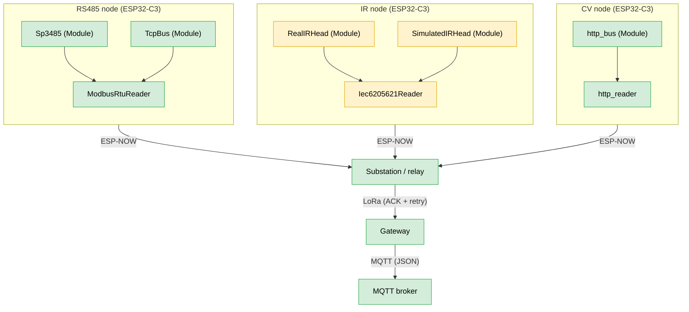

# Focault Dynamics IoT Firmware
Firmware for the Focault Dynamics IoT metering network, a QUT capstone project.
The repository began as a fork of [NEXTGEN_IEMS](https://github.com/kahoQUT/NEXTGEN_IEMS),
. The goal of this repository is to move every node onto the
ESP32-C3 SuperMini and give each one a swappable meter-reading module (RS485,
IR optical head, or camera) chosen by its role in the network.

## System Overview



| Colour | Meaning |
|---|---|
| Green | Works (RS485 and CV paths tested, ESP-NOW, LoRa and MQTT working) |
| Yellow | Untested (IR path) |

## Architecture

Three abstractions stack on top of each other. Each layer knows only about the
one below it, so a node is assembled by picking one of each.

| Layer | Header | Responsibility |
|---|---|---|
| `Module` | `lib/interfaces/module/module.h` | Moves raw bytes over one physical bus. Knows its pins and its peripheral, knows nothing about meaning. `init()`, `send()`, `readByte()`, `available()`. |
| `Reader` | `lib/interfaces/reader/reader.h` | Speaks a meter protocol on top of a `Module&`. Turns registers into values. `init(Module&, const void *config)`, `get_import()`, `get_export()`, `get_voltage()`. |
| `Transmitter` | `lib/interfaces/transmitter/transmitter.h` | Moves whole packets to a peer address. `init()`, `sendPacket()`, `receivePacket()`. |

Configuration is a plain struct per protocol, defined in
`lib/node_config/node_config.h`. `Reader::init()` takes it as `const void *` and
each reader casts to the struct it expects, which keeps the base interface free
of every protocol's fields. The `load*Config()` functions in `node_config.cpp`
are hardcoded seams; upstream configuration selection replaces their bodies
later without touching any call site (FUTURE IMPLEMENTATION).

Role dispatch lives in `src/main.cpp`. `readModuleType()` is currently hardcoded
to `Rs485Node` and is meant to read a hardware ID pin, which the hardware team
owns. (in `node_config.cpp`)

## What Works Today

### Unified firmware, `unified` env, `src/main.cpp` + `src/nodes/`

`setup()` reads the module type, prints it, and calls the matching
`*NodeSetup()`. `loop()` calls the matching `*Loop()`. An unknown type idles and
reminds on serial every 5 seconds.

| Node | File | State |
|---|---|---|
| `rs485_node` | `src/nodes/rs485_node.cpp` | Reads import, export, voltage over Modbus RTU every 10 s and prints them. Does not transmit. |
| `substation` | `src/nodes/substation.cpp` | Working. Verbatim port of the LilyGo sketch. |
| `gateway` | `src/nodes/gateway.cpp` | Working. Verbatim port of the gateway sketch. |
| `ir_node` | `src/nodes/ir_node.cpp` | Prints a not-implemented notice. Stack lives on `ir-module`. |
| `cv_node` | `src/nodes/cv_node.cpp` | Prints a not-implemented notice. |

### `Sp3485`, `lib/buses/sp3485/`

RS485 transceiver as a `Module`.

### `ModbusRtuReader`, `lib/protocols/modbus_rtu/`

ModbusRTU protocol `Reader`

### `Wifi`, `lib/wifi/`

ESP-NOW based `Transmitter`

### `TCPBus`, `lib/tcpBus`

TCP `Module` created for ModbusRTU over TCP testing 

## In Progress

### Meter-reading modules not yet started

| Module | State | Missing include |
|---|---|---|
| `lib/esp32cam/` | Empty. The `.cpp` is two includes and a TODO, with no method bodies | `cam_link_protocol.h` |
| `lib/buses/ir_head/` | Header only, and it declares nothing. Comment block ends "decide the modulation scheme and fill in the class" | `pin_config.h` |


## Repository Layout

```text
Project_Kaizen/
├── lib/
│   ├── interfaces/
│   │   ├── module/          Module base class
│   │   ├── reader/          Reader base class
│   │   ├── transmitter/     Transmitter base class
│   │   └── shared/          shared_payload.h
│   ├── config/
│   │   ├── node_config/     Per-node config structs
│   │   ├── nvs_config/      NVS loaders filling the config structs
│   │   └── secrets/         secrets.h
│   ├── buses/
│   │   ├── sp3485/          RS485 transceiver Module
│   │   ├── http_bus/        HTTP client Module for the ESP32-CAM
│   │   ├── tcp_bus/         RTU-over-TCP Module
│   │   ├── lora/            SX1276 radio Module
│   │   └── ir_head/         Optical probe Module
│   ├── protocols/
│   │   ├── modbus_rtu/      Modbus RTU Reader
│   │   ├── cam_http/        ESP32-CAM Reader
│   │   └── iec62056_21/     IEC 62056-21 optical protocol
│   ├── links/
│   │   ├── esp_now_uplink/  ESP-NOW Transmitter
│   │   ├── lora_link/       LoRa Transmitter with ACKs
│   │   └── wifi_radio/      Radio mode, channel and softAP
│   └── state/
│       ├── seq_counter/     Persistent reading sequence number
│       └── reading_buffer/  Substation store and forward buffer
├── src/
│   ├── main.cpp                       role dispatch
│   └── nodes/
│       ├── nodes.h
│       ├── rs485_node.cpp
│       ├── substation.cpp
│       ├── gateway.cpp
│       ├── ir_node.cpp
│       └── cv_node.cpp
├── ModbusSim/
│   ├── ModbusSimSerial.py
│   ├── ModbusSimTCP.py
│   ├── poll_test.py
│   └── README.md
├── test/
├── platformio.ini
└── README.md
```

## Directory Guide

What each directory is for, and where to look when you need to change something.

### `src/`

The firmware entry points. `main.cpp` holds `readModuleType()` and the two
`switch` statements that dispatch into a role; it is the only file that knows all
five roles exist.

`src/nodes/` holds one `.cpp` per role, each exposing just a `*Setup()` and a
`*Loop()` through `nodes.h`. This is the assembly layer: a node file is where a
`Module`, a `Reader`, and a `Transmitter` get picked, constructed from a config,
and wired together. Nothing in `lib/` knows which node uses it.

`lib/config/secrets/secrets.h` holds credentials and the substation MAC. It sits outside
`src/` so the NVS loaders in `lib/config/nvs_config/` can include it.

### `lib/`

Every reusable piece of the firmware, one subdirectory per library, compiled by
PlatformIO into separate static libraries. Libraries are grouped one level down:
`interfaces/` holds the three abstract base classes and the shared payload,
`config/` the config structs and their NVS loaders, `buses/` the `Module`
implementations, `protocols/` the `Reader` implementations, `links/` the
`Transmitter` implementations and the radio they share, and `state/` the
persistent counters and buffers. `lib_extra_dirs` in `platformio.ini` lists each
group so PlatformIO still finds every library inside it.

PlatformIO only compiles a library that something includes, which is why the
unfinished ones do not break the build. **See `lib/README` for a description of
each subdirectory** and how the layers fit together.

### `ModbusSim/`

Python `pymodbus` servers that impersonate a meter, plus a client to poll them.
This is how the Modbus reader is developed without hardware. See
`ModbusSim/README.md` for the register map and setup

### `test/`

PlatformIO Test Runner directory. Empty apart from the stock placeholder README.
No tests exist yet.


## PlatformIO Environments

Both environments build the same sources, `main.cpp` and `nodes/`. They differ
only in the board they target.

| Environment | Board | Use |
|---|---|---|
| `unified` (default) | `esp32-c3-devkitm-1` | **Builds.** The current architecture, for every node type. Role is hardcoded to `Rs485Node`. |
| `lilygo_lora` | `ttgo-lora32-v21` | **Builds.** The LilyGo LoRa board, for testing the substation and gateway roles. |

`unified` sets `ARDUINO_USB_MODE` and `ARDUINO_USB_CDC_ON_BOOT` so serial output
appears over the C3's native USB. `lilygo_lora` does not need them, because that
board talks to the computer through a USB to UART bridge chip.

## Hardware

- ESP32-C3 SuperMini as the meter end-node
- LilyGo / ESP32 LoRa OLED board as the substation relay and as the gateway,
  inherited from NEXTGEN_IEMS. The OLED is unused.
- SX1276 LoRa module and antennas
- SP3485 RS485 transceiver on the meter node
- An MQTT broker

RS485 pins come from `loadModbusRtuConfig()` in `lib/node_config/node_config.cpp`:
`RX 8`, `TX 9`, `DE/RE 10`, at 9600 baud `SERIAL_8N1`.

LoRa pins are identical in the substation and gateway and are still `#define`d
separately in each file rather than shared: `SCK 4`, `MISO 5`, `MOSI 6`, `SS 7`,
`RST 3`, `DIO0 1`.

## `secrets.h` Configuration

The firmware expects `lib/config/secrets/secrets.h`:

```cpp
#define SECRET_WIFI_SSID "Damian7777"
#define SECRET_WIFI_PASS "87654321"

#define SECRET_MQTT_SERVER "broker.hivemq.com"
#define SECRET_MQTT_PORT 1883
#define SECRET_MQTT_TOPIC "qut_ems_project_888/ems/ZoneA/meters"
#define SECRET_MAC {0xF0, 0x24, 0xF9, 0x93, 0x04, 0x5C}
#define SECRET_LORA_BAND 433E6 // 915E6

#define SECRET_AP_SSID "kaizen-rs485"
#define SECRET_AP_PASS "kaizen123"      // WPA2 minimum is 8 chars
#define SECRET_MODBUS_SIM_HOST "192.168.4.2"   // was 192.168.1.100
#define SECRET_MODBUS_SIM_PORT 5020

```

- Contains WIFI configurations for a substation
- Contains configurations for LoRa and MQTT
- Contains configurations for Modbus over TCP

## Payload Format

Defined in `lib/interfaces/shared/shared_payload.h`, packed to 26 bytes:

```cpp
#pragma pack(push, 1)
struct Payload {
    uint32_t uid;           // Node/Device ID
    uint32_t seq;           // Sequence number for deduplication
    float kwh_import;       // 1.8.0 value
    float kwh_export;       // 2.8.0 value
    float voltage;          // Grid voltage
    uint8_t community_id;
    uint8_t unit_id;
};

struct AckPayload {
    uint32_t uid;
    uint32_t seq;
};
#pragma pack(pop)
```

Every device must use the same struct. Both the ESP-NOW receive path and the LoRa
receive path reject frames on a `sizeof()` mismatch, so if you change this file,
rebuild and reflash all environments together.


## Modbus Simulator

`ModbusSim/` holds two `pymodbus` servers used to develop the meter-reading side
without physical hardware. Both expose a three-value register map, voltage at
address 0, export kWh at 2, import kWh at 4, each a 32-bit big-endian pair, with
values that change on every poll. These addresses match the
`MeterModel::Simulated_Serial` and `MeterModel::Simulated_Tcp` rows in
`node_config.cpp`.

- `ModbusSimTCP.py` serves RTU-over-TCP on `0.0.0.0:5020`. This is what
  `lib/buses/tcp_bus/` talks to.
- `ModbusSimSerial.py` serves RTU on a serial port, hardcoded to `/dev/ttyUSB0`.
- `poll_test.py` is a minimal RTU-over-TCP client that reads all three registers
  and decodes them, useful for confirming the server before pointing firmware at
  it.

See `ModbusSim/README.md` for venv setup, how to poll with
`python3 -m pymodbus.console`, and the `socat` null-modem recipe for the serial
variant.

## Troubleshooting

**ESP-NOW send fails.** Check `SECRET_MAC` is the substation's MAC. Confirm both
devices are powered and on the same channel. `EspNowConfig::channel` of 0 means
"use whatever the interface is already on", so if one side pins a channel and the
other does not, delivery fails silently until the send timeout.

**Modbus response incomplete or CRC mismatch.** Confirm baud rate and
`SerialConfig` match the meter, since T3.5 is derived from them. Check the DE/RE
pin is wired to `cfg.bus.dere` (GPIO 10 by default). Point the node at
`ModbusSim` first to separate a protocol problem from a wiring problem.

**Readings are 1000x off.** `RegisterFormat` in `loadModbusRtuConfig()` is set to
`ScaledInt`, which divides the raw 32-bit value by 1000. Meters that publish IEEE
754 floats need `IEEE_754Float`.

**LoRa receive size mismatch.** Confirm every device was built from the same
`shared_payload.h`, and that both LoRa devices use the same `SECRET_LORA_BAND`.
Rebuild and reflash all environments after any payload change.

**MQTT does not connect.** Check the server and port, confirm the broker accepts
anonymous connections, and avoid wildcard characters such as `+` in the publish
topic.

**No serial output from the gateway.** Expected on native USB with the legacy
`gateway` environment, which is built without USB CDC. Use `unified` instead, or
an external USB-to-serial adapter, or add the two `ARDUINO_USB_*` build flags.

**Nothing on serial right after boot.** The `unified` build prints its banner
immediately, before USB CDC has enumerated, so the first lines are easy to miss.
Attach the monitor before resetting the board.
