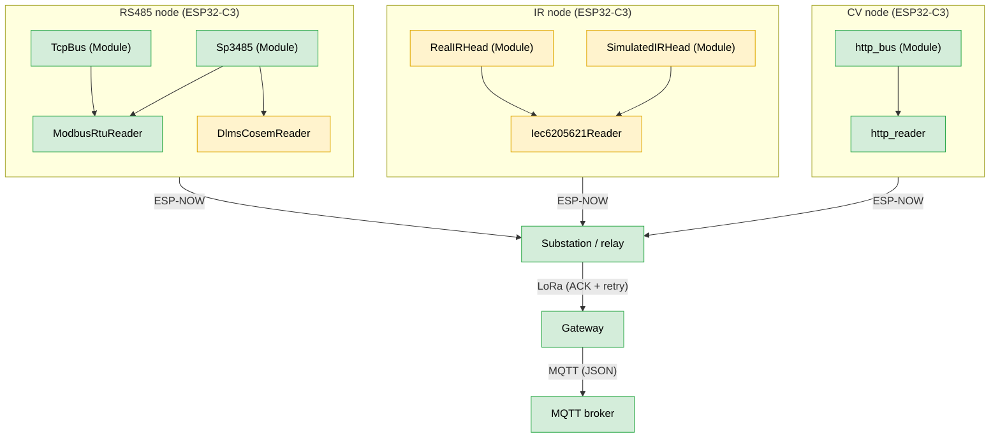

# Focault Dynamics IoT Firmware
Firmware for the Focault Dynamics IoT metering network, a QUT capstone project.
The repository began as a fork of [NEXTGEN_IEMS](https://github.com/kahoQUT/NEXTGEN_IEMS),
. The goal of this repository is to move every node onto the
ESP32-C3 SuperMini and give each one a swappable meter-reading module (RS485,
IR optical head, or camera) chosen by its role in the network.

## Documentation

API docs for every class, function and config struct are published at
**https://foucault-dynamics.github.io/IoT-Firmware/**, rebuilt from the code on
every push to `main`. The commenting rules the site is built from are in
[`docs/COMMENTING.md`](docs/COMMENTING.md). How to run and write the unit
tests is in [`docs/TESTING.md`](docs/TESTING.md). To build the docs locally:

```sh
brew install doxygen graphviz
doxygen
open build/docs/index.html
```

## System Overview



| Colour | Meaning |
|---|---|
| Green | Works (RS485 and CV paths tested, ESP-NOW, LoRa and MQTT working) |
| Yellow | Untested on hardware (IR path, DLMS/COSEM reader) |

## Architecture

All reusable code lives in `lib/`, split into six groups. `src/` holds the firmware itself: one entry file
per PCB picks a node role, and `src/nodes/` assembles that node from the libraries.

### Lib directory

The lib directory contains all code for which the main loop and setup depends inside of `src`

| Folder | Role | Terminology |
|---|---|---|
| `lib/interfaces/` | Abstract base classes and the shared packet format | |
| `lib/config/` | Shape of each node's settings, how they are loaded, and NVS configuration | |
| `lib/buses/` | Physical hardware that moves raw bytes | **Modules** |
| `lib/protocols/` | Meter protocols that turn bytes into values | **Readers** |
| `lib/links/` | The radio, and what sits on top of it | **Transmitters** |
| `lib/buffering/` | Buffering of the substation | |

Three abstractions sit at the centre. A node is assembled by picking one of
each. The definitions live in `lib/interfaces/`, and every implementation in the
other groups derives from one of them.

| Layer | Folder | Header | Responsibility |
|---|---|---|---|
| `Module` | `lib/interfaces/module/` | `module.h` | Moves raw bytes over one physical bus. Knows its pins and its peripheral, knows nothing about meaning. `init()`, `send()`, `readByte()`, `available()`. |
| `Reader` | `lib/interfaces/reader/` | `reader.h` | Speaks a meter protocol on top of a `Module&`. Turns registers into values. `init(Module&)`, `get_import()`, `get_export()`, `get_voltage()`. |
| `Transmitter` | `lib/interfaces/transmitter/` | `transmitter.h` | Moves whole packets to a peer address. `init()`, `sendPacket()`, `receivePacket()`. |

A `Reader` holds a `Module&` and is stacked on top of it. `Module` and
`Transmitter` are siblings: a meter node holds a `Module` facing the meter and a
`Transmitter` facing the substation.

### Configuration

Configuration is a plain struct per node role, defined in `lib/config/node_config/`
(for example `rs485_config.h`, `gateway_config.h`). The structs hold shapes only.
Firmware defaults for every field live in `lib/config/secrets/`. Each concrete
reader, module or Transmitter takes its config in its own constructor, which keeps every protocol's
fields out of the shared base interface.

### NVS

`lib/config/nvs_config/` has one loader per node, which fills that node's config
struct. Each field is read from NVS if it was ever set, and otherwise falls back
to the firmware default from `lib/config/secrets/`. The loaders are the seam
where upstream configuration selection will replace the defaults later without
touching any call site **(FUTURE IMPLEMENTATION)**.

### Role dispatch

Each PCB gets its own firmware image, so the build decides which PCB a board is
and `readModuleType()` only picks a role within that PCB.

- `src/end_node_main.cpp` picks RS485, IR or CV. `readModuleType()` currently asks
  over serial, and is meant to be replaced by driving current to `GPIO3` and reading the
  voltage difference over `GPIO4` **(FUTURE IMPLEMENTATION WHEN FINAL PCB AVAILABLE)**.
- `src/lora_main.cpp` picks substation or gateway. `readModuleType()` currently asks
  over serial, and will read whatever ID mechanism the hardware team puts on the LoRa PCB
  **(FUTURE IMPLEMENTATION)**.

### Basic flow

Flow begins in the PCB's entry file where the serial monitor is prompted to choose a given module
(Replaced with the Role Dispatch in the future). Based on the module type the given setup is called in `src/nodes`,
and subsequently its respective loop. At the beginning of each loop, the serial buffer is parsed for any NVS configuration
to be set (more information in the NVS subfolder README).


## Repository Layout

```text
Project_Kaizen/
├── lib/
│   ├── interfaces/
│   │   ├── module/          Module base class
│   │   ├── reader/          Reader base class
│   │   ├── transmitter/     Transmitter base class
│   │   └── shared/          shared_payload.h
│   ├── config/
│   │   ├── node_config/     Per-node config structs
│   │   ├── nvs_config/      NVS loaders filling the config structs
│   │   └── secrets/         secrets.h
│   ├── buses/
│   │   ├── sp3485/          RS485 transceiver Module
│   │   ├── http_bus/        HTTP client Module for the ESP32-CAM
│   │   ├── tcp_bus/         RTU-over-TCP Module
│   │   ├── lora/            SX1276 radio Module
│   │   └── ir_head/         Optical probe Module
│   ├── protocols/
│   │   ├── modbus_rtu/      Modbus RTU Reader
│   │   ├── dlms_cosem/      DLMS/COSEM Reader over HDLC
│   │   ├── cam_http/        ESP32-CAM Reader
│   │   └── iec62056_21/     IEC 62056-21 optical protocol
│   ├── links/
│   │   ├── esp_now_uplink/  ESP-NOW Transmitter
│   │   ├── lora_link/       LoRa Transmitter with ACKs
│   │   └── wifi_radio/      Radio mode, channel and softAP
│   └── buffering/
│       ├── seq_counter/     Persistent reading sequence number
│       └── reading_buffer/  Substation store and forward buffer
├── src/
│   ├── end_node_main.cpp              end node role dispatch
│   ├── lora_main.cpp                  LoRa PCB role dispatch
│   └── nodes/
│       ├── nodes.h
│       ├── rs485_node.cpp
│       ├── substation.cpp
│       ├── gateway.cpp
│       ├── ir_node.cpp
│       └── cv_node.cpp
├── ModbusSim/
│   ├── ModbusSimSerial.py
│   ├── ModbusSimTCP.py
│   ├── poll_test.py
│   └── README.md
├── IrSim/
│   ├── IrSimSerial.py
│   ├── IrSimTCP.py
│   ├── ir_poll_test.py
│   ├── native/
│   └── README.md
├── test/
│   ├── support/             FakeBus, shared by the driver tests
│   ├── test_qemu_*/         unit tests run in QEMU
│   └── test_board_*/        tests that need a real C3
├── tools/
│   ├── setup_qemu.sh        downloads Espressif's QEMU
│   └── qemu_test.py         runs a test build in QEMU
├── platformio.ini
└── README.md
```

## PlatformIO Environments

Each firmware environment builds one PCB's image: its entry file plus only the
nodes that PCB runs. `test_c3` builds the unit tests instead, see
[`docs/TESTING.md`](docs/TESTING.md).

| Environment | Board | Use |
|---|---|---|
| `end_node` (default) | `esp32-c3-devkitm-1` | **Builds.** The end node image, `end_node_main.cpp` with the RS485, IR and CV nodes. |
| `lilygo_lora` | `ttgo-lora32-v21` | **Builds.** The LoRa PCB image, `lora_main.cpp` with the substation and gateway nodes, on the LilyGo LoRa board. |
| `test_c3` | `esp32-c3-devkitm-1` | Unit tests in emulated ESP32-C3, `pio test -e test_c3 --without-uploading`. |

There is no C3 build of the LoRa image yet, because the LoRa pins in
`lib/config/nvs_config/lora_loader.cpp` are the LilyGo pins. It gets added once
the LoRa PCB pinout exists.

**Note**:` end_node` sets `ARDUINO_USB_MODE` and `ARDUINO_USB_CDC_ON_BOOT` so serial output
appears over the C3's native USB. `lilygo_lora` does not need them, because that
board talks to the computer through a USB to UART bridge chip.

## Hardware

- ESP32-C3 SuperMini as the meter end-node
- LilyGo / ESP32 LoRa OLED board as the substation relay and as the gateway,
  inherited from NEXTGEN_IEMS. The OLED is unused.
- SX1276 LoRa module and antennas
- SP3485 RS485 transceiver on the meter node
- An MQTT broker

## Payload Format

Defined in `lib/interfaces/shared/shared_payload.h`, packed to 26 bytes:

```cpp
#pragma pack(push, 1)
struct Payload {
    uint32_t uid;           // Node/Device ID
    uint32_t seq;           // Sequence number for deduplication
    float kwh_import;       // 1.8.0 value
    float kwh_export;       // 2.8.0 value
    float voltage;          // Grid voltage
    uint8_t community_id;
    uint8_t unit_id;
};

struct AckPayload {
    uint32_t uid;
    uint32_t seq;
};
#pragma pack(pop)
```

Every device must use the same struct. Both the ESP-NOW receive path and the LoRa
receive path reject frames on a `sizeof()` mismatch, so if you change this file,
rebuild and reflash all environments together.


## Modbus Simulator

`ModbusSim/` holds two `pymodbus` servers used to develop the meter-reading side
without physical hardware. Both expose a three-value register map, voltage at
address 0, export kWh at 2, import kWh at 4, each a 32-bit big-endian pair, with
values that change on every poll. These addresses match the
`MeterModel::Simulated_Serial` and `MeterModel::Simulated_Tcp` rows in
`node_config.cpp`.

- `ModbusSimTCP.py` serves RTU-over-TCP on `0.0.0.0:5020`. This is what
  `lib/buses/tcp_bus/` talks to.
- `ModbusSimSerial.py` serves RTU on a serial port, hardcoded to `/dev/ttyUSB0`.
- `poll_test.py` is a minimal RTU-over-TCP client that reads all three registers
  and decodes them, useful for confirming the server before pointing firmware at
  it.

See `ModbusSim/README.md` for venv setup, how to poll with
`python3 -m pymodbus.console`, and the `socat` null-modem recipe for the serial
variant.

## IR Simulator

`IrSim/` is the IR counterpart: a fake IEC 62056-21 mode C meter in plain
Python, with import and export kWh that go up on every read.

- `IrSimTCP.py` serves the optical port's bytes over TCP on `0.0.0.0:5021`. The
  IR node reaches it through `TcpIrHead` with `set simulate 2`.
- `IrSimSerial.py` serves them on a serial port at 300 baud 7E1, switching baud
  rate like a real meter, for testing `RealIrHead` through a USB to serial
  adapter.
- `ir_poll_test.py` reads either one the way the firmware does.
- `native/run.sh` builds the firmware's real `Iec6205621Reader` for the laptop
  and runs it against fake meters, no board needed.

See `IrSim/README.md` for each way of testing, from laptop only up to the PCB.
